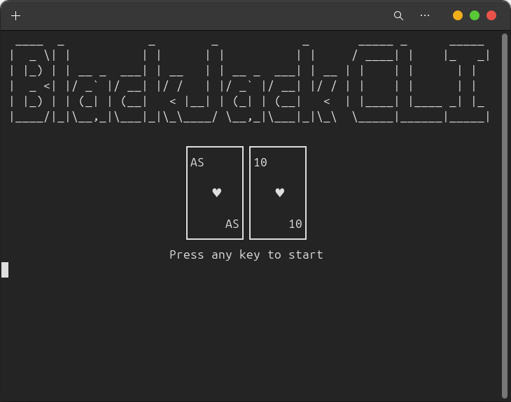
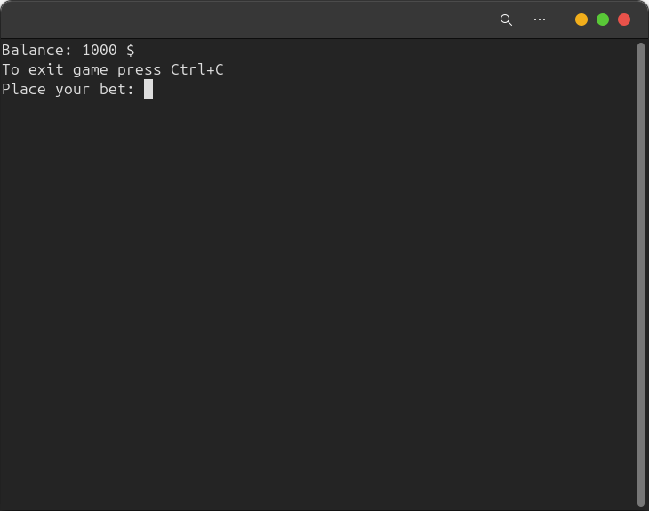
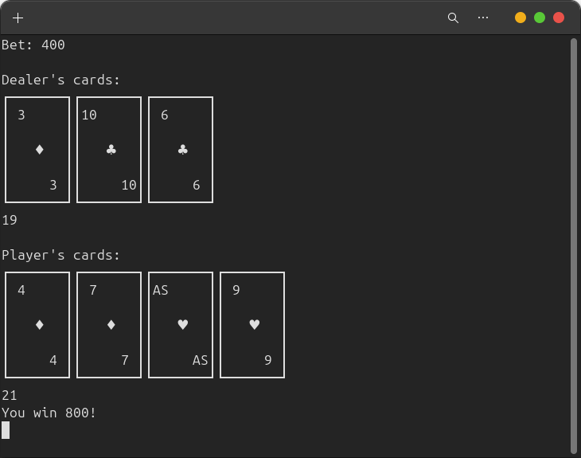
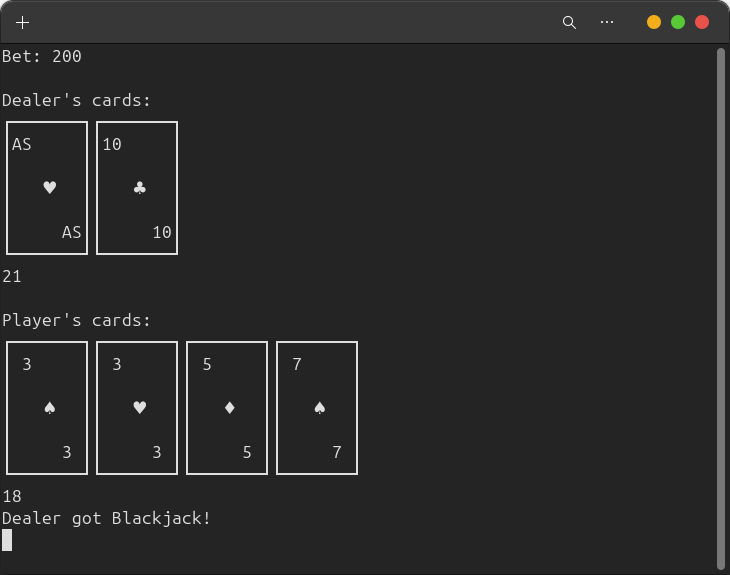

# 🃏 BlackJack CLI

BlackJack CLI is a lightweight, terminal-based implementation of the classic Blackjack card game written in C#. It features a human player vs dealer, optional card counting bot, and full game logic including split, double down, and insurance.

## 📸 Gameplay Preview

<p align="center">
  
  <br><em>Start screen</em>
</p>

<p align="center">
  
  <br><em>Place your bet</em>
</p>

<p align="center">
  
  <br><em>Example round</em>
</p>

<p align="center">
  
  <br><em>Dealer hits Blackjack</em>
</p>

## 🎯 Features

- Play classic Blackjack in your terminal (CLI)
- Support for doubling, splitting, and insurance
- Dealer AI and full player decision handling
- Optimal for card-counting (counter enabled by default)
- Cross-platform: Windows, Linux, macOS
- Self-contained builds (no .NET installation required)

## ⌨️ Controls

You can type the full command or just the first letter:

- `Hit` → `h`
- `Stand` → `s`
- `Double Down` → `dd`

To turn off card counter type "--count" while running in terminal
To turn off card sums type "--sums" while running in terminal

To exit the game: `Ctrl+C`

## 🔽 Downloads (Self-contained builds)

- 🪟 **Windows x64**  
  [➡ Download ZIP](https://github.com/Porzeraklon/blackjack/releases/latest/download/BlackJackCLI-win-x64.zip)

- 🐧 **Linux x64**  
  [➡ Download TAR.XZ](https://github.com/Porzeraklon/blackjack/releases/latest/download/BlackJackCLI-linux-x64.tar.xz)

- 🍎 **macOS x64**  
  [➡ Download TAR.XZ](https://github.com/Porzeraklon/blackjack/releases/latest/download/BlackJackCLI-osx-x64.tar.xz)

Unpack the archive and run the executable inside.

## 🛠️ Build Instructions

Requires [.NET SDK 9.0](https://dotnet.microsoft.com/en-us/download/dotnet/9.0) or later.

```bash
git clone https://github.com/porzeraklon/blackjack.git
cd blackjack
```

Then build for your target OS:

- 🪟 **Windows x64**  
  ```bash
  dotnet publish -c Release -r win-x64 --self-contained true /p:PublishTrimmed=true
  ```

- 🐧 **Linux x64**  
  ```bash
  dotnet publish -c Release -r linux-x64 --self-contained true /p:PublishTrimmed=true
  ```

- 🍎 **macOS x64**  
  ```bash
  dotnet publish -c Release -r osx-x64 --self-contained true /p:PublishTrimmed=true
  ```

## 🙋 About

This project was created as a clean, educational example of implementing game logic in a cross-platform CLI environment using .NET.
Contributions and forks are welcome.
